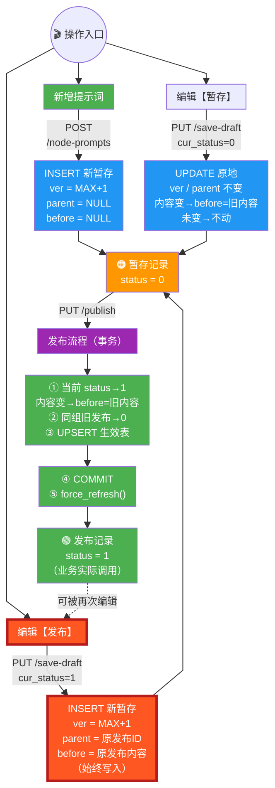
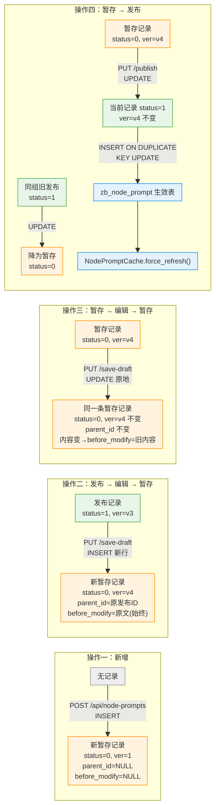
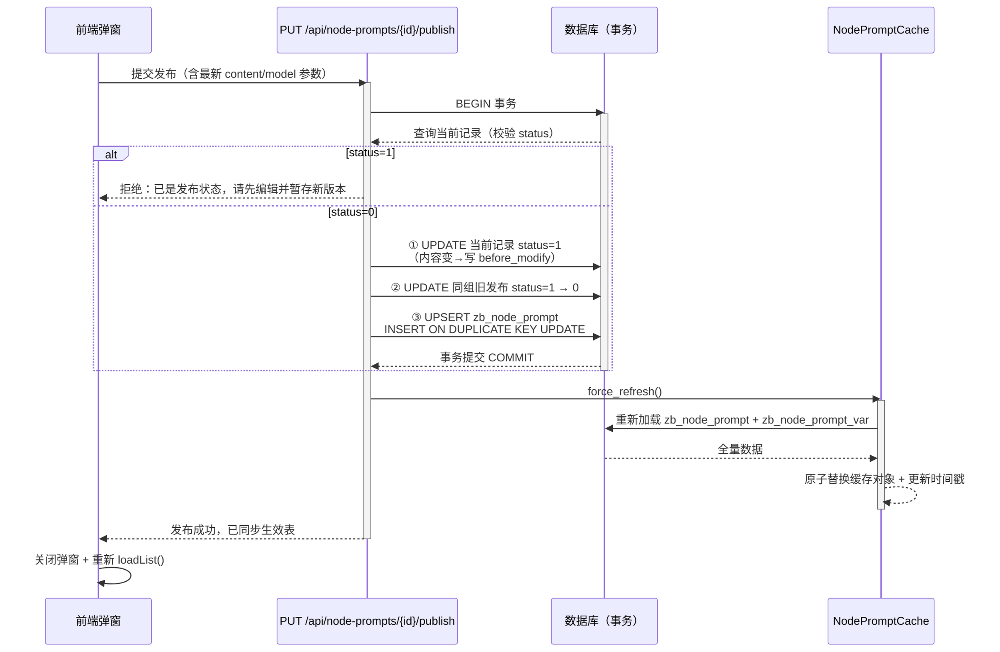
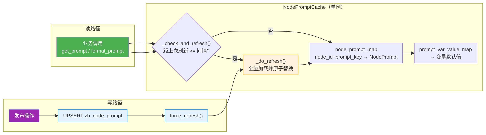

# 节点提示词版本管理设计文档

> 本文档基于 `app/api/manage_api.py`、`app/db_connection_pool/zb_node_prompt_util.py`、`app/static/node_config_manager/index.html`、`app/db_scripts/schema_unified.sql` 的实际实现梳理而成，作为前后端联调与后续维护的权威说明。

## 一、数据库表结构设计

### 1.1 提示词版本控制表（zb_node_prompt_ver_ctrl）

存储提示词所有版本记录、状态、版本溯源、修改履历。所有版本流转操作（新增 / 暂存 / 发布）均发生在该表。

```sql
CREATE TABLE `zb_node_prompt_ver_ctrl` (
  `id` bigint NOT NULL AUTO_INCREMENT COMMENT '自增主键',
  `node_id` varchar(64) NOT NULL COMMENT '节点id',
  `node_name` varchar(200) NOT NULL COMMENT '节点名称（冗余，便于查询）',
  `prompt_key` varchar(32) NOT NULL COMMENT '提示词的key，便于在代码中通过该key拿到提示词',
  `prompt_content` text COMMENT '提示词的实际内容',
  `model_id` varchar(64) DEFAULT NULL COMMENT '关联的模型ID，引用zb_llm_models表，不为空时覆盖节点级的模型配置',
  `model_ext_param` json DEFAULT NULL COMMENT '模型其他参数配置，JSON格式字符串，用于覆盖模型默认参数（如temperature、top_p等）',
  `status` tinyint DEFAULT NULL COMMENT '当前的提示词状态。0=暂存；1=发布。每一个 node_id、prompt_key 只有一个发布状态的提示词',
  `prompt_content_before_modify` text COMMENT '修改前的提示词的实际内容',
  `version_no` int NOT NULL COMMENT '版本号',
  `parent_id` bigint DEFAULT NULL COMMENT '当前版本的上一来源记录ID，用于版本溯源',
  `created_at` timestamp NOT NULL DEFAULT CURRENT_TIMESTAMP COMMENT '创建时间',
  `updated_at` timestamp NOT NULL DEFAULT CURRENT_TIMESTAMP ON UPDATE CURRENT_TIMESTAMP COMMENT '更新时间',
  `update_by` varchar(64) NOT NULL COMMENT '修改人',
  PRIMARY KEY (`id`),
  KEY `idx_node_id` (`node_id`)
) ENGINE=InnoDB DEFAULT CHARSET=utf8mb4 COLLATE=utf8mb4_0900_ai_ci COMMENT='节点提示词配置历史表';
```

> **与早期设计稿的差异说明**
> - `node_name` 实际为 `varchar(200) NOT NULL`（早期稿为 `varchar(64) DEFAULT NULL`）。
> - `model_id` 实际为 `varchar(64)` 字符串，引用 `zb_llm_models.model_id`（早期稿误标为 `bigint`）。
> - `model_ext_param` 实际为 `json` 类型（早期稿为 `text`）。
> - `status` 实际为 `DEFAULT NULL`，由应用层保证写入 0/1（早期稿为 `NOT NULL DEFAULT 0`）。
> - 索引仅保留 `idx_node_id`；`idx_parent_id` 未建。如需频繁递归溯源查询，可按需补充 `KEY idx_parent_id (parent_id)` 与 `KEY idx_node_prompt (node_id, prompt_key)`。

### 1.2 节点提示词生效配置表（zb_node_prompt）

存储当前正式上线、业务流程实际调用的提示词配置。**仅发布操作同步更新此表**，暂存 / 新增操作均不触发生效表。运行时由 `NodePromptCache` 加载该表提供查询。

```sql
CREATE TABLE `zb_node_prompt` (
  `id` bigint NOT NULL AUTO_INCREMENT COMMENT '自增主键',
  `node_id` varchar(64) NOT NULL COMMENT '节点id',
  `prompt_key` varchar(32) NOT NULL COMMENT '提示词的key',
  `prompt_content` text COMMENT '提示词的实际内容',
  `model_id` varchar(64) DEFAULT NULL COMMENT '关联的模型ID，引用zb_llm_models表，不为空时覆盖节点级的模型配置',
  `model_ext_param` json DEFAULT NULL COMMENT '模型其他参数配置，JSON格式字符串',
  `created_at` timestamp NOT NULL DEFAULT CURRENT_TIMESTAMP COMMENT '创建时间',
  `updated_at` timestamp NOT NULL DEFAULT CURRENT_TIMESTAMP ON UPDATE CURRENT_TIMESTAMP COMMENT '更新时间',
  PRIMARY KEY (`id`),
  UNIQUE KEY `uk_node_prompt` (`node_id`, `prompt_key`),
  KEY `idx_node_id` (`node_id`)
) ENGINE=InnoDB DEFAULT CHARSET=utf8mb4 COLLATE=utf8mb4_0900_ai_ci COMMENT='节点提示词配置表';
```

> 生效表通过 `uk_node_prompt (node_id, prompt_key)` 唯一键保证同一节点同一 Key 仅一条生效记录，发布时使用 `INSERT ... ON DUPLICATE KEY UPDATE` 完成 UPSERT。

### 1.3 节点提示词变量表（zb_node_prompt_var，关联表）

该表不在版本管理流转范围内，但与提示词运行时渲染强相关，故在此说明。存储提示词插值变量名及其默认值，供 `NodePromptCache.format_prompt()` 在运行时进行 `{变量}` 插值。

```sql
CREATE TABLE `zb_node_prompt_var` (
  `id` bigint NOT NULL AUTO_INCREMENT,
  `node_id` varchar(64) NOT NULL COMMENT '节点id',
  `prompt_key` varchar(32) NOT NULL COMMENT '提示词的key，关联node_prompt表',
  `prompt_var_name` varchar(32) NOT NULL COMMENT '提示词插值变量名',
  `prompt_var_value` varchar(1024) DEFAULT NULL COMMENT '提示词插值变量值',
  `created_at` timestamp NOT NULL DEFAULT CURRENT_TIMESTAMP,
  `updated_at` timestamp NOT NULL DEFAULT CURRENT_TIMESTAMP ON UPDATE CURRENT_TIMESTAMP,
  PRIMARY KEY (`id`),
  UNIQUE KEY `uk_node_prompt_var` (`node_id`, `prompt_key`, `prompt_var_name`),
  KEY `idx_prompt` (`node_id`, `prompt_key`)
) ENGINE=InnoDB DEFAULT CHARSET=utf8mb4 COLLATE=utf8mb4_0900_ai_ci COMMENT='节点提示词变量表';
```

> 变量取值优先级：`zb_node_prompt_var.prompt_var_value`（库内默认值） > 调用方运行时传入的 `var_values`。

---

## 二、基础字段与枚举说明

### 2.1 status 状态枚举

| 状态值 | 状态名称 | 说明 |
|---|---|---|
| 0 | 暂存 | 未正式发布，不同步业务生效表，可被编辑（原地保存）或发布 |
| 1 | 发布 | 正式生效，同一 (node_id, prompt_key) 下有且仅允许一条发布记录 |

### 2.2 parent_id 设计说明

| 属性 | 说明 |
|---|---|
| 含义 | 记录当前版本的前身来源记录 ID，构建版本链路溯源 |
| 约束 | 根版本（新增初始记录）为 NULL；由"编辑发布记录 → 暂存"衍生的新暂存记录指向被编辑的发布记录 ID |
| 查询 | 当前仅有 `idx_node_id` 索引，递归溯源可通过应用层循环查询 `WHERE id = :parent_id` 实现 |

### 2.3 prompt_content_before_modify 字段说明

| 规则 | 说明 |
|---|---|
| 写入条件 | **仅在本次操作使 prompt_content 发生变化时写入**，记录修改前的内容 |
| 未修改时 | UPDATE 操作不包含该字段（保留原值不变）；INSERT 新增行时为 NULL |
| 特例 | "编辑发布记录 → 暂存"走 INSERT 新行路径，此时 **始终写入** 被编辑发布记录的原文（因为新行本身就是一次内容变更） |
| 用途 | 版本回溯、内容对比、回滚参考 |

### 2.4 version_no 版本号规则

- 按 `(node_id, prompt_key)` 维度独立递增，不全局递增
- 新增 / 由发布记录衍生暂存时，取组内 `COALESCE(MAX(version_no), 0) + 1`（全新 prompt_key 即为 1）
- 原地更新暂存记录时，版本号不变

### 2.5 update_by 修改人

- 请求体 `PromptVerItem.update_by` 字段，默认 `"system"`；前端弹窗默认填 `"admin"`，可手动修改
- 新增、暂存、发布操作均会写入当前操作人

---

## 三、业务流程总览

### 3.1 状态流转图

> 竖向（TD）布局，移除"查看"只读分支；发布事务的 5 个 SQL 步骤合并为 2 个多行节点（DB 操作 / 提交刷新），使纵向层数从约 11 层压缩至约 7 层，在预览面板内可完整显示。所有 SQL 信息保留在合并节点内。



### 3.2 四种核心操作对比图



### 3.3 发布操作事务时序图

发布是唯一会触发生效表与缓存刷新的操作，且全程在单个数据库事务内完成，保证状态切换与生效表同步的原子性。



### 3.4 运行时缓存与生效表联动



> **缓存要点**
> - `NodePromptCache` 为单例，采用懒加载：每次读取时检查时间戳，超过 `AI_INTENT_FLOW_NODE_PROMPT_CACHE_REFRESH_INTERVAL`（默认 60s，支持 Apollo 热更新）则后台全量刷新。
> - 刷新使用双重检查锁（`asyncio.Lock`），并将新数据组装成 `_PromptCacheData` 后一次性替换引用，保证读路径看到的缓存始终一致。
> - **仅发布操作主动调用 `force_refresh()`**；新增、暂存不触发生效表，因此也不刷新缓存。

---

## 四、完整业务场景说明

### 场景一：新增提示词

**触发入口**：列表节点行「新增提示词」链接 / 顶部工具栏「新增」按钮（弹窗内下拉选择节点）

**前置条件**：弹窗仅显示「暂存」按钮，「发布」按钮隐藏；提示文案为「新增将创建 version_no=1 的暂存记录」

**后端逻辑**（`POST /api/node-prompts`）：

```
1. Pydantic 校验：node_id、prompt_key 必填；prompt_content 默认 ""；update_by 默认 "system"
2. 查询该 (node_id, prompt_key) 组内 COALESCE(MAX(version_no), 0)
3. INSERT 新记录：
   - status = 0（暂存）
   - version_no = MAX + 1（全新 prompt_key 则为 1）
   - parent_id = NULL
   - prompt_content_before_modify = NULL
4. 不操作 zb_node_prompt 生效表，不刷新缓存
```

**结果**：版本控制表新增一条暂存记录，不触发生效表。

---

### 场景二：编辑已发布记录 → 点击暂存

**触发入口**：列表子行中，发布状态记录的「编辑」按钮

**前置条件**：
- 弹窗仅显示「暂存」按钮，「发布」按钮隐藏
- 提示文案：「编辑发布记录将另存为新的暂存版本（版本号+1）」
- `prompt_key` 字段只读（不可修改）

**后端逻辑**（`PUT /api/node-prompts/{record_id}/save-draft`，cur_status=1）：

```
1. 查询当前记录，确认 status = 1（发布）
2. 取组内 COALESCE(MAX(version_no), 0) + 1 作为新版本号
3. INSERT 新记录：
   - status = 0（暂存）
   - version_no = 新版本号
   - parent_id = 被编辑的发布记录 ID（record_id）
   - prompt_content_before_modify = 发布记录的 prompt_content（始终写入）
   - 其余字段使用用户提交的最新值
4. 原发布记录保持不变
5. 不操作 zb_node_prompt 生效表，不刷新缓存
```

**结果**：产生一条新的暂存记录，`parent_id` 指向原发布记录。原发布记录仍为发布状态，继续生效。

---

### 场景三：编辑暂存记录 → 点击暂存

**触发入口**：列表子行中，暂存状态记录的「编辑」按钮

**前置条件**：
- 弹窗显示「暂存」+「发布」两个按钮
- 提示文案：「编辑暂存记录将原地保存（版本号不变）」
- `prompt_key` 字段只读

**后端逻辑**（`PUT /api/node-prompts/{record_id}/save-draft`，cur_status=0）：

```
1. 查询当前记录，确认 status = 0（暂存）
2. 比较新旧 prompt_content：
   - 内容发生变化 → UPDATE SET prompt_content_before_modify = 旧内容
   - 内容未变化 → 不操作 prompt_content_before_modify 字段
3. UPDATE 当前记录（WHERE id = record_id AND status = 0）：
   - prompt_content、model_id、model_ext_param、node_name、update_by 更新为最新值
   - updated_at = NOW()
   - status 保持 0，version_no 不变，parent_id 不变
4. 不操作 zb_node_prompt 生效表，不刷新缓存
```

**结果**：同一条暂存记录被覆盖更新，id、版本号、parent_id 均不变。

---

### 场景四：暂存记录 → 点击发布

**触发入口**：列表子行中暂存状态记录的「发布」按钮，或编辑暂存记录弹窗中的「发布」按钮

**前置条件**：
- 已发布记录无法通过前端直接发布（前端拦截：编辑发布记录弹窗不显示「发布」按钮；点击发布时若 status=1 弹窗提示）
- 后端二次校验：status=1 时拒绝并返回「该记录已是发布状态，无法重复发布。请先编辑并暂存新版本后再发布。」

**后端逻辑**（`PUT /api/node-prompts/{record_id}/publish`，事务内执行）：

```
1. 查询当前记录，校验 status != 1（若 status=1 直接拒绝）
2. 比较新旧 prompt_content，内容变化时记录 prompt_content_before_modify
3. UPDATE 当前暂存记录（WHERE id = record_id）：
   - status = 1（发布）
   - prompt_content、model_id、model_ext_param、update_by 更新为最新值
   - 内容变化时设置 prompt_content_before_modify，否则不动该字段
   - updated_at = NOW()
4. UPDATE 同 (node_id, prompt_key) 下其他 status=1 的记录 → status=0（降为暂存）
   - WHERE node_id, prompt_key, status=1, id != record_id
5. UPSERT zb_node_prompt 生效表：
   - INSERT ... ON DUPLICATE KEY UPDATE，同步当前发布内容/模型参数
6. 事务提交 COMMIT
7. 事务外触发 NodePromptCache.force_refresh()（异常被吞掉，不影响发布结果）
```

**结果**：
- 当前记录变为发布状态
- 旧的发布记录降为暂存
- 生效表同步更新
- 缓存强制刷新

---

### 场景五：查看提示词（只读）

**触发入口**：列表子行中任意记录的「查看」按钮

**前置条件**：弹窗所有字段只读，不显示任何操作按钮；提示文案为「只读查看」

**行为**：仅展示记录详情，不做任何后端写入操作。

---

## 五、操作汇总表

| 操作 | 前端按钮 | 后端动作 | version_no | parent_id | prompt_content_before_modify | zb_node_prompt | 缓存刷新 |
|---|---|---|---|---|---|---|---|
| 新增 | 仅暂存 | INSERT | max+1 | NULL | NULL | 不更新 | 不刷新 |
| 发布→编辑→暂存 | 仅暂存 | INSERT 新行 | max+1 | 原发布记录ID | 始终=原发布内容 | 不更新 | 不刷新 |
| 暂存→编辑→暂存 | 暂存+发布 | UPDATE 原地 | 不变 | 不变 | 内容变→旧内容; 未变→不动 | 不更新 | 不刷新 |
| 暂存→发布 | 发布 | UPDATE + UPDATE + UPSERT | 不变 | 不变 | 内容变→旧内容; 未变→不动 | **同步更新** | **force_refresh** |
| 查看 | 无 | 无 | — | — | — | 不更新 | 不刷新 |

---

## 六、parent_id 溯源规则

| 操作场景 | parent_id |
|---|---|
| 新增初始提示词 | NULL |
| 编辑发布记录 → 暂存 | 被编辑的发布记录 ID |
| 编辑暂存记录 → 暂存 | 保持原值不变 |
| 暂存记录 → 发布 | 保持原值不变 |

通过 `parent_id` 字段可递归追溯任意记录的完整版本演变链路（根版本为 NULL）。

---

## 七、API 接口清单

### 7.1 版本管理接口

| 方法 | 路径 | 说明 |
|---|---|---|
| GET | `/api/node-configs` | 分页查询节点 + 提示词版本列表（主行 `zb_conversation_nodes`，子行 `_children` 来自 `zb_node_prompt_ver_ctrl`；支持 node_id / node_name / prompt_key / status / keyword 过滤） |
| GET | `/api/node-prompts/{record_id}` | 查询单条提示词版本记录详情（含 parent_id、version_no、prompt_content_before_modify） |
| POST | `/api/node-prompts` | 新增提示词（直接暂存，version_no=组内最大+1） |
| PUT | `/api/node-prompts/{record_id}/save-draft` | 保存草稿（发布记录→新增暂存行；暂存记录→原地更新） |
| PUT | `/api/node-prompts/{record_id}/publish` | 发布提示词（状态切换 + 生效表同步 + 缓存刷新，事务执行） |

### 7.2 配置查询接口（只读，供前端下拉 / 业务运行时使用）

| 方法 | 路径 | 说明 |
|---|---|---|
| GET | `/api/nodes` | 获取对话流程节点列表（来自 `zb_conversation_nodes` 缓存，供新增弹窗下拉选择） |
| GET | `/api/prompts` | 获取意图节点提示词配置列表（来自 `zb_node_prompt` 缓存，运行时生效配置） |

### 7.3 请求体模型（PromptVerItem）

新增 / 暂存 / 发布接口统一使用以下请求体：

| 字段 | 类型 | 必填 | 默认值 | 说明 |
|---|---|---|---|---|
| node_id | string | 是 | — | 节点ID |
| node_name | string | 否 | `""` | 节点名称（冗余，缺省回填 node_id） |
| prompt_key | string | 是 | — | 提示词Key |
| prompt_content | string | 否 | `""` | 提示词内容 |
| model_id | string | 否 | `null` | 引用 `zb_llm_models.model_id`，留空使用节点级模型 |
| model_ext_param | string(JSON) | 否 | `null` | 模型扩展参数 JSON 字符串，如 `{"max_tokens":65536}` |
| update_by | string | 否 | `"system"` | 修改人（前端默认 `admin`） |

> 响应统一格式：`{ "code": 0, "message": "...", "data": ... }`，`code=0` 表示成功，`code=-1` 表示失败。

---

## 八、前端交互规则

### 8.1 列表页

- **搜索栏**：节点ID、节点名称、提示词Key、状态下拉（全部 / 发布 / 暂存），支持回车查询与重置
- **工具栏按钮**：查询、重置、权限配置（开发中）、新增（顶部，弹窗内下拉选择节点）
- **树形结构**：节点行（父行）第一列显示 ▶/▼ 展开/折叠按钮；展开后显示该节点下所有提示词版本子行（按 id 倒序）
- **父行操作**：「新增提示词」链接
- **子行操作**：
  - 发布记录：编辑、查看
  - 暂存记录：编辑、查看、发布
- **分页**：支持 10/20/30/50/100 条/页，含跳页

### 8.2 弹窗按钮显隐规则

弹窗通过隐藏域 `pmMode`（new/edit/view/publish）控制按钮显隐：

| 弹窗模式 | 暂存按钮 | 发布按钮 | prompt_key | 内容框 |
|---|---|---|---|---|
| 新增（new） | ✅ 显示 | ❌ 隐藏 | 可编辑 | 可编辑 |
| 编辑发布记录（edit, status=1） | ✅ 显示 | ❌ 隐藏 | 只读 | 可编辑 |
| 编辑暂存记录（edit, status=0） | ✅ 显示 | ✅ 显示 | 只读 | 可编辑 |
| 发布确认（publish） | ❌ 隐藏 | ✅ 显示 | 只读 | 可编辑 |
| 查看（view） | ❌ 隐藏 | ❌ 隐藏 | 只读 | 只读 |

### 8.3 弹窗字段

弹窗包含：选择节点（仅顶部新增显示下拉）、节点ID（只读）、节点名称（只读）、提示词Key、提示词内容（textarea，支持 `{变量}` 占位符）、模型ID、模型参数(JSON)、修改人（默认 `admin`）。

提交前前端校验：
- `model_ext_param` 非空时必须为合法 JSON，否则提示并阻止提交
- `node_id`、`prompt_key`、`prompt_content` 必填

### 8.4 前后端双重校验

| 校验项 | 前端 | 后端 |
|---|---|---|
| 发布状态记录不可直接发布 | 编辑发布记录弹窗隐藏「发布」按钮；点击发布时 status=1 弹窗拦截 | status=1 时拒绝并返回提示文案 |
| 提示词内容 / Key 必填 | 弹窗提交前校验 | Pydantic 校验 node_id、prompt_key 必填 |
| 模型参数为合法 JSON | 提交前 `JSON.parse` 校验 | — |
| 同 (node_id, prompt_key) 最多一条发布 | — | 发布时自动将旧发布 status 置 0 |
| 记录不存在 | 刷新列表 | 返回「记录不存在」 |
| 重复发布 | 弹窗拦截 | 返回「已是发布状态」 |

---

## 九、数据一致性约束

1. **唯一发布约束**：同一 `(node_id, prompt_key)` 任意时刻仅允许一条 `status=1` 的记录，由发布流程的「旧发布降级」步骤保证。
2. **生效表唯一约束**：`zb_node_prompt` 通过 `uk_node_prompt (node_id, prompt_key)` 唯一键 + `INSERT ... ON DUPLICATE KEY UPDATE` 保证同一组仅一条生效记录。
3. **版本号独立递增**：`version_no` 按 `(node_id, prompt_key)` 维度独立递增，不全局递增；新增与「发布→暂存」均取组内 `MAX+1`。
4. **事务原子性**：发布操作的状态切换（当前记录置 1、旧发布置 0）与生效表 UPSERT 在同一数据库事务内执行，原子提交；缓存刷新在事务提交后执行。
5. **修改前内容留存**：`prompt_content_before_modify` 在提示词内容变化时记录修改前原文，未变化则不写入（保留原值）；「发布→暂存」走 INSERT 新行路径时始终写入。
6. **生效表隔离**：只有发布操作同步更新 `zb_node_prompt` 并刷新缓存；新增、暂存操作既不触发生效表，也不刷新缓存。
7. **版本溯源**：`parent_id` 严格记录版本衍生关系，从根（NULL）到叶形成完整链路树。
8. **缓存一致性**：`NodePromptCache` 懒加载 + 发布主动 `force_refresh`，读路径始终基于最新生效配置；缓存刷新失败被吞掉异常，不回滚已提交的发布事务（最终一致，下一轮定时刷新会自愈）。